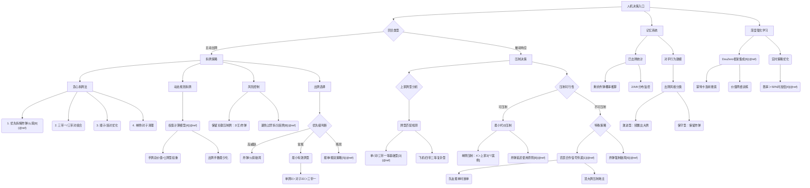

```mermaid
graph TD
    A[人机决策入口] --> B{回合类型}
    
    %% 主动出牌逻辑链
    B -->|主动出牌| C[拆牌策略]
    C --> C1[贪心拆牌法]
    C1 --> C11("1. 优先拆解炸弹/火箭[8](@ref)")
    C1 --> C12("2. 三带一/三带对组合")
    C1 --> C13("3. 顺子/连对优化")
    C1 --> C14("4. 单牌/对子清理")
    
    C --> C2[动态规划拆牌]
    C2 --> C21("权值计算模型[4](@ref)")
    C21 --> C211("手牌总价值=∑牌型权重")
    C21 --> C212("出牌手数最少化")
    
    C --> C3[风险控制]
    C3 --> C31("保留关键压制牌：2/王/炸弹")
    C3 --> C32("避免过早拆分连牌[8](@ref)")
    
    C --> D[出牌选择]
    D --> D1{优先级判断}
    D1 -->|高威胁| D11("炸弹/火箭破局")
    D1 -->|常规| D12("最小有效牌型")
    D12 --> D121("单牌3＞对子33＞三带一")
    D1 -->|残局| D13("报单/报双策略[5](@ref)")
    
    %% 被动响应逻辑链
    B -->|被动响应| E[压制决策]
    E --> E1{上家牌型分析}
    E1 --> E11("牌型匹配检测")
    E11 --> E111("单/对/三带一等基础型[3](@ref)")
    E11 --> E112("飞机/四带二等复杂型")
    
    E --> E2{压制可行性}
    E2 -->|可压制| E21("最小代价压制")
    E21 --> E211("单牌压制：4＞上家3[^7案例]")
    E21 --> E212("炸弹延迟使用原则[8](@ref)")
    
    E2 -->|不可压制| E22{特殊策略}
    E22 --> E221("农民合作信号传递[1](@ref)")
    E221 --> E2211("队友报单时放单")
    E221 --> E2212("顶大牌压制地主")
    E22 --> E222("炸弹强制破局[6](@ref)")
    
    %% 状态管理模块
    A --> F[记忆系统]
    F --> F1("已出牌统计")
    F1 --> F11("剩余炸弹概率推算")
    F1 --> F12("2/A/K分布监控")
    
    F --> F2("对手行为建模")
    F2 --> F21("出牌风格分类")
    F21 --> F211("激进型：频繁出大牌")
    F21 --> F212("保守型：保留炸弹")
    
    %% 强化学习扩展
    A --> G[深度强化学习]
    G --> G1("DouZero框架集成[6](@ref)")
    G1 --> G11("蒙特卡洛树搜索")
    G1 --> G12("价值网络训练")
    G --> G2("实时策略优化")
    G2 --> G21("胜率＞50%时加倍[4](@ref)")
```